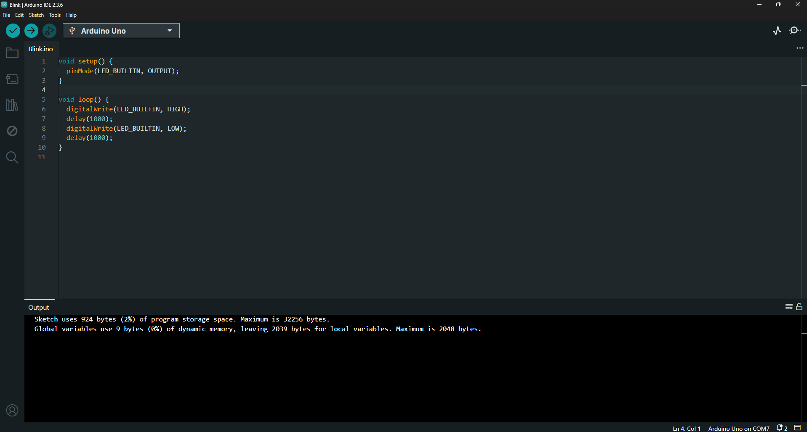
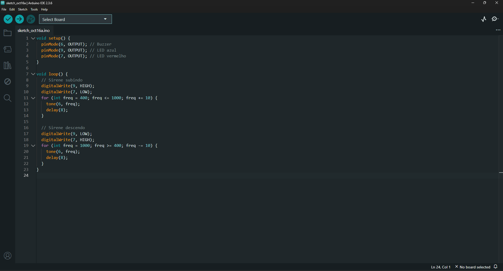
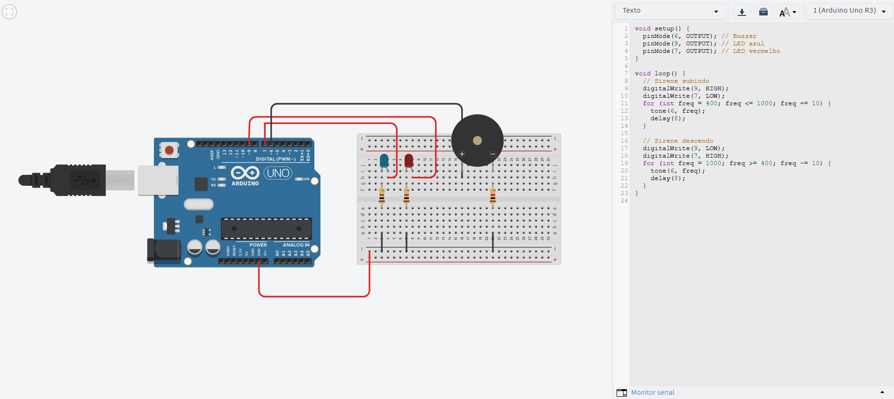

# Arduino - Guia de Instalação e Uso

## Pré-requisitos

- Computador com Windows, macOS ou Linux
- Cabo USB para conectar o Arduino
- Placa Arduino (Arduino Uno recomendado)

## Instalação do Arduino IDE

### 1. Download
1. Acesse o site oficial: https://www.arduino.cc/en/software
2. Baixe a versão mais recente do Arduino IDE para seu sistema operacional
3. Execute o instalador e siga as instruções na tela

### 2. Configuração Inicial
1. Abra o Arduino IDE
2. Conecte seu Arduino ao computador via cabo USB
3. Vá em **Ferramentas > Placa** e selecione seu modelo de Arduino (ex: Arduino Uno)
4. Vá em **Ferramentas > Porta** e selecione a porta COM onde o Arduino está conectado

## Como Executar o Código

### 1. Carregar o Código
1. Abra o arquivo `.ino` no Arduino IDE
2. Clique no botão **Verificar** (✓) para compilar o código
3. Se não houver erros, clique no botão **Carregar** (→) para enviar o código ao Arduino
4. Aguarde a mensagem "Carregamento concluído"

### 2. Monitorar a Execução
- Para ver mensagens do código, abra o **Monitor Serial** em **Ferramentas > Monitor Serial**
- Certifique-se que a velocidade (baud rate) está configurada corretamente (geralmente 9600)

## Projetos

### Arduino Uno - Parte 01
**Link do drive:** https://drive.google.com/drive/u/0/folders/1xP3CF4_a9tYBZGZJbi1A11jN7nBIB_E0

---

### Arduino Uno - Parte 02
**Link do drive:** https://drive.google.com/drive/u/0/folders/1xP3CF4_a9tYBZGZJbi1A11jN7nBIB_E0

---

### Simulação no Tinkercad

## Recursos Adicionais

- [Documentação oficial do Arduino](https://docs.arduino.cc/)
- [Tutoriais Arduino](https://www.arduino.cc/en/Tutorial/HomePage)
- [Tinkercad Circuits](https://www.tinkercad.com/circuits)
